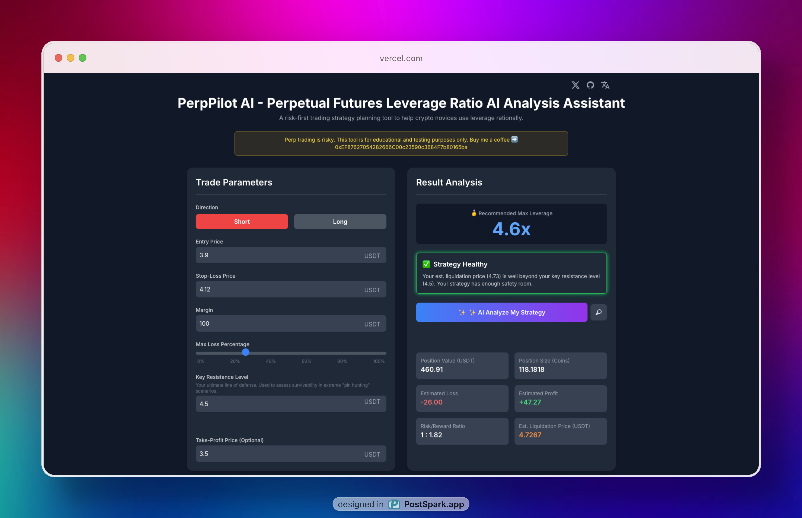
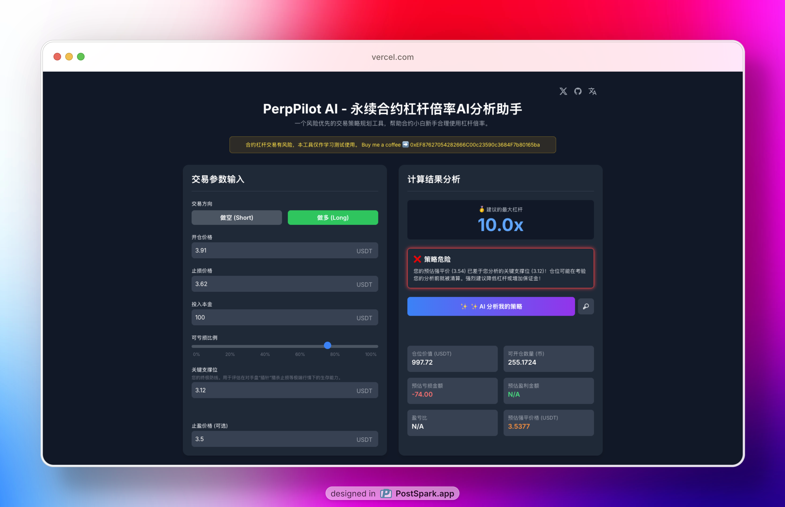
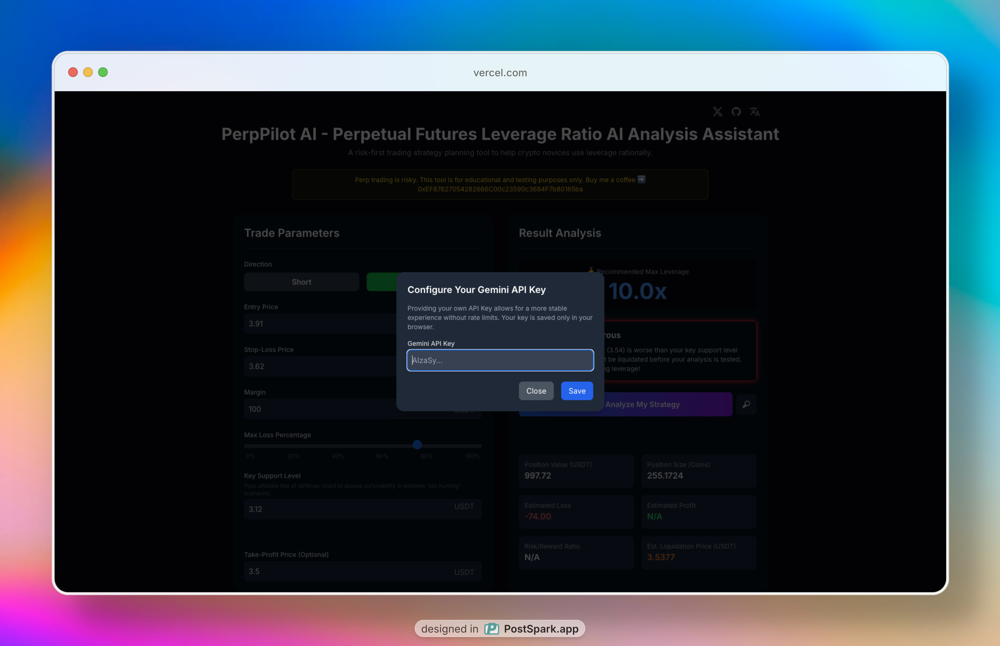

<h1 align="center">
  <a href="https://perppilot.iamkane.com">
     
  </a>
</h1>

 | <a href="https://perppilot.iamkane.com/"> Online Demo </a> ｜<a href="./docs/README.zh.md">PRD(中文) </a> ｜ <a href="./docs/README.en.md">PRD(English) </a> |  <a href="https://github.com/szkane/PerpPilot-A/issues">Feedback</a> 

  
[![][license-shield]][license-link]
[![][commercial-shield]][commercial-link]
[![][sponsor-shield]][sponsor-link]

# PerpPilot AI

PerpPilot-AI is an intelligent, AI-driven tool designed to guide novice and intermediate perpetual futures traders toward safer and more rational trading habits. We address the core problem where traders, lured by high returns, often prioritize high leverage over sound risk management, leading to poorly planned strategies and premature liquidations.

Our tool flips this paradigm by adopting a "risk-first" approach. You start with what truly matters: your market analysis (entry and stop-loss prices) and your risk commitment (the maximum percentage of capital you're willing to lose). PerpPilot-AI then reverse-calculates the most sustainable leverage ratio tailored to your specific plan.

Key features include a real-time "Strategy Health Analysis" that stress-tests your plan against extreme market moves, and an integrated AI assistant powered by Gemini. This assistant acts as your neutral co-pilot, providing clear, educational feedback on your plan's logic—helping you build confidence and make decisions based on strategy, not speculation.

🎯 PerpPilot-AI is for new futures traders, calculating the safest leverage from their own trading plan to solve the dangerous problem of simply guessing what leverage to use.

## 中文简介

PerpPilot-AI 是一款由 AI 驱动的智能工具，旨在引导合约新手和中阶交易者建立更安全、更理性的交易习惯。我们致力于解决一个核心痛点：交易者常常被高回报吸引，错误地将高杠杆置于风险管理之上，这往往导致策略规划不善和不必要的提前爆仓。

我们的工具通过采用“风险优先”的原则，彻底颠覆了这种思维模式。您从最重要的事情开始：您的市场分析（开仓价和止损价）和您的风险承诺（您愿意承担的最大本金亏损比例）。然后，PerpPilot-AI 会为您的特定计划反向推算出最合理的、可持续的杠杆倍数。

产品的核心功能包括实时的“策略健康度分析”，它能评估您的计划在极端行情下的生存能力；以及一个由 Gemini 驱动的集成式 AI 助手。这个助手会像一个中立的副驾驶一样，为您的策略逻辑提供清晰、具有教育意义的反馈——帮助您建立信心，并基于策略而非侥幸来做出决策。

🎯 PerpPilot-AI 为合约新手而生，能根据你的交易计划反向计算出最安全的杠杆倍数，解决了凭感觉、拍脑袋选杠杆的危险难题。

# 🌠 Screenshot

# 🌟 Key Features

### 🧮 1. Core Calculator Functionality 核心计算器功能

- **Reverse Calculation of Optimal Leverage 反向推算最优杠杆:**
  The core feature that calculates the maximum suggested leverage based on the user's entry price, stop-loss price, principal, and acceptable loss percentage.
  核心功能，基于用户的开仓价、止损价、本金和可亏损比例，反向计算出建议的最大杠杆倍数。

- **⚡ Real-time Calculation of Key Trade Metrics 关键交易指标的实时计算:**
  Instantly calculates and displays essential trade data as user inputs change, without needing a "calculate" button. (Includes: Position Value, Position Size, Est. Profit/Loss, Est. Liquidation Price, R/R Ratio).
  当用户输入变化时，无需点击“计算”按钮，即时计算并显示关键的交易数据。（包括：仓位价值、可开仓数量、预估盈亏、预估强平价、盈亏比）。

- **🚦 Strategy Health Analysis 策略健康度分析:**
  Provides a color-coded (💚 Green/🧡 Orange/ ❤️ Red) risk rating by comparing the calculated liquidation price against the user's defined "Key Resistance/Support Level."
  通过对比计算出的强平价格与用户设定的“关键阻力/支撑位”，提供颜色编码（💚 安全/🧡 关注/❤️ 危险）的风险评级。

### ✨ 2. AI-Enhanced Features AI 增强功能

- **AI-Powered Strategy Analysis & Feedback AI 驱动的策略分析与反馈:**
  Utilizes Gemini to provide a qualitative, educational analysis of the user's trading plan, focusing on risk factors, stop-loss placement, and leverage logic. Explicitly avoids giving investment advice.
  利用 Gemini 为用户的交易计划提供定性的、教育性质的分析，重点关注风险因素、止损设置和杠杆逻辑。明确不提供投资建议。

- **🔑 Custom API Key Configuration 自定义 API Key 配置:**
  Allows advanced users to input and save their own Gemini API Key in `localStorage` for a more stable and personal AI analysis experience.
  允许高阶用户输入并在浏览器的 `localStorage` 中保存自己的 Gemini API Key，以获得更稳定、个人化的 AI 分析体验。

### 🎨 3. User Interface & User Experience (UI/UX) 用户界面与用户体验

- **📱💻 Responsive UI Layout 响应式界面布局:**
  The interface automatically adapts for optimal viewing and interaction on PC, tablet, and mobile devices.
  界面自动适应，以便在 PC、平板和移动设备上获得最佳的浏览和操作体验。

- **🔄 Dynamic UI Elements 动态 UI 元素:**
  Interface components change contextually based on user input. For example, the "Key Level" label switches between "Key Support" (for Long) and "Key Resistance" (for Short).
  界面组件根据用户输入进行上下文切换。例如，“关键位”的标签会根据“做多/做空”选择，在“关键支撑位”和“关键阻力位”之间切换。

- **⚠️ Smart Input Validation Logic 智能输入验证逻辑:**
  Provides non-blocking, real-time warnings if the user sets a stop-loss price that is logically inconsistent with their stated key support/resistance level.
  提供非阻塞的实时警告。当用户设置的止损价格与其设定的关键支撑/阻力位在逻辑上不一致时触发。

### 🛠️ 4. System & Technical Requirements 系统与技术需求

- **🌐 Internationalization (i18n) Support 国际化 (i18n) 支持:**
  Supports both English and Chinese (Simplified). Includes auto-detection of browser language on first visit and allows for manual switching, with the preference saved for future sessions.
  支持英文和简体中文。包括首次访问时自动检测浏览器语言，并允许用户手动切换，该偏好将被保存以备将来访问。

- **📢 Prominent Risk Disclaimer Banner 醒目的风险提示横幅:**
  A visually distinct banner clearly states the risks of leverage trading and the educational purpose of the tool.
  一个视觉上突出的横幅，清晰地声明杠杆交易的风险以及本工具的教育目的。

# ❓ Why PerpPolit AI？

🧠 You've studied a coin, you know its key support and resistance levels, and you're painfully aware of how it can suddenly "wick" down to hunt stop-losses. You have a solid trading idea, but the big question remains: how do you choose the right leverage so you don't get wiped out by that market noise?

Most new traders just guess a number—10x, 20x, 50x—and hope for the best. This is a recipe for disaster. Your carefully placed stop-loss, set just outside that key level, becomes useless if your leverage is too high. You get liquidated before the market even has a chance to prove your analysis right.

This is exactly where PerpPilot-AI changes the game. 💡 Instead of you gambling on a leverage number, you tell the tool your strategy:

- ✅ Your ideal entry price.

- 🛡️ Your strategic stop-loss, placed safely beyond that tricky "wick zone".

- 💰 The exact amount of money you're truly willing to risk on this trade.

PerpPilot-AI then instantly does the math for you, calculating the maximum safe leverage your specific plan can handle. It empowers you to use your hard-won market knowledge to make a rational, risk-first decision, giving your strategy the breathing room it needs to succeed. ✨

---

🧠 你研究了一个币，清楚它的关键支撑和阻力位，甚至对它会突然“插针”来猎杀止损的特性了如指掌。你有一个不错的交易思路，但最大的问题依然存在：到底该如何选择杠杆，才能避免被这种市场噪音直接扫地出门？

大多数新手只是凭感觉猜一个数字——10 倍、20 倍、50 倍——然后听天由命。这是通往灾难的捷径。你精心设置的、放在关键位置之外的止损点，在过高的杠杆面前将变得毫无意义。在市场有机会证明你的分析是正确的之前，你就已经爆仓了。

这正是 PerpPilot-AI 改变游戏规则的地方。💡 你不再需要去赌一个杠杆倍数，而是把你自己的策略告诉工具：

- ✅ 你理想的开仓价格。

- 🛡️ 你策略性的止损位置，安全地设在那个恼人的“插针区域”之外。

- 💰 在这笔交易中，你真正愿意承担风险的确切金额。

然后，PerpPilot-AI 会立即为你完成计算，找出你的专属计划所能承受的最大安全杠杆。它赋予你力量，让你能够运用自己好不容易得来的市场知识，做出理性的、风险优先的决策，给你精心设计的策略留出它应有的、用以成功的喘息空间。✨
